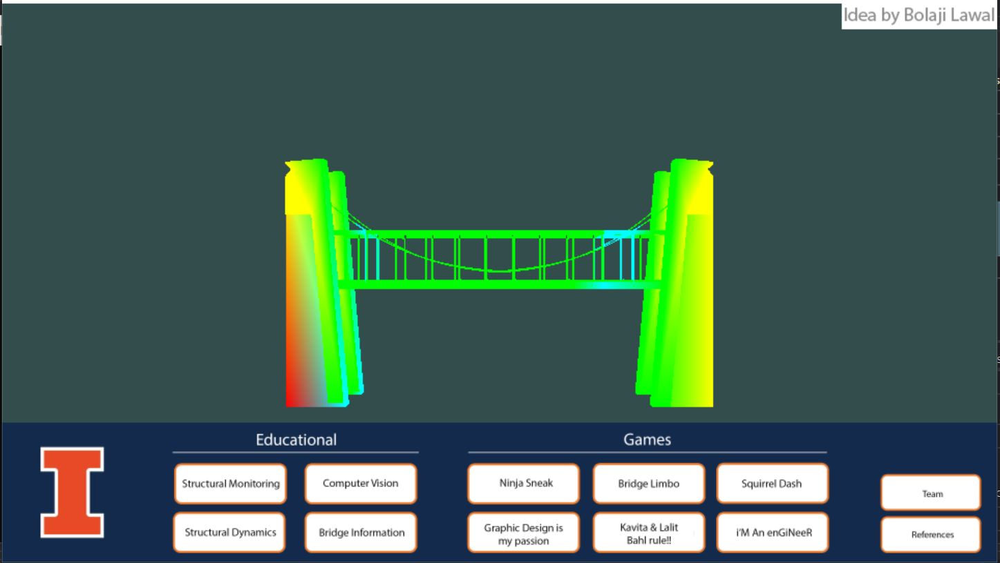
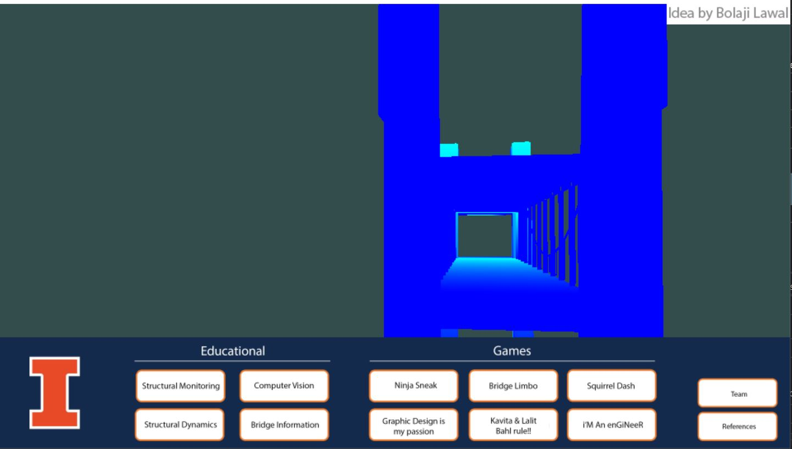
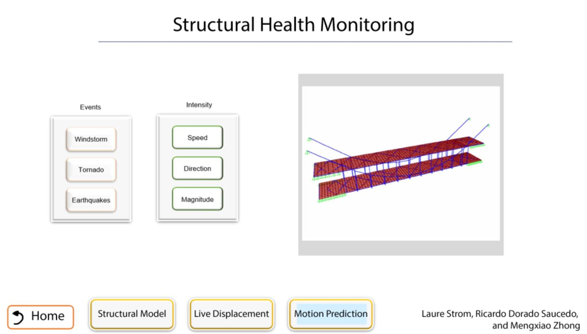

# Prototype Application for UIUC Smart Bridge Sensor Data Showcase

This GitHub repository is my code for a prototype 3D application I developed from scratch for UIUC's Smart Bridge using C++, OpenGL, and SDL2. The application renders a 3D model of the bridge with different colors that represent the bridge sensor's acceleration readings and allows the user to "fly" around the bridge to inspect different views. I also added functionality for menus and various pages of educational content.

I was the sole developer of this project and heavily used LearnOpenGL as a reference for the base of the project before expanding upon it.

Very detailed descriptions of what the project does and its context can be found in the following sections. For references for this project, please see the last section.

Note: The bridge model and information are not included in the repository due to security reasons. Also, some music and other mdeia were removed from the repository due to potential copyright issues.

## Project Context

The University of Illinois at Urbana Champaign (UIUC) recently built a smart bridge between its Civil Engineering laboratory and its Hydrosystems building. Both buildings and the bridge are a part of the Civil & Environmental Engineering (CEE) department. The smart bridge is equipped with a large array of accelerometers, a weather station, and other sensors that give data about the bridge. 

For the grand opening of the bridge in Spring 2022, the department wanted to have a showcase of all of the potential benefits of the bridge. This showcase was developed by the CEE 573: Structural Dynamics II class as part of their final project. At that time, I was one of the TA's for the class and helped the students develop their ideas as well as created a way to combine them all into one coherent interface over the course of the semester. Thus, this project was born. 

A figure of the main menu with the bridge model is below. Each page has a tag that contains the name of the student(s) who came up with the original conceptual idea. 

## Project Functionalities & Development Process

First, I used LearnOpenGL as a reference and implemented basic functions such as vertex and fragment shaders, linking vertex attributes, loading textures, adding a camera, and loading and viewing 3D models. This gave me a base for the project. 

Next, I added a game loop and the ability for the user to "fly" around the bridge to look at different views. The game loop checks for user input and processes it. If the user hits the "Escape" key, then the program will close. If the user hits a certain button on the screen, then the program will change states to that page. Additionally, the user can "fly" around the bridge by hitting the "W", "A", "S", and "D" keys, and move the camera around with the arrow keys at the same time. There is also a way to zoom in with the "E" key and zoom out with the "Q" key. The game loop also sets different variables for the shader and renders the desired graphics. A screenshot of the interface after the user has flown around to the end of the bridge is shown below.

Then, I added the ability to load and render a 3D model using LearnOpenGL as a reference and added the different graphics for the various states. Due to the time contraints of this project, all of the states, except for the main page, consist of an image with photos of the information desired and buttons that go to other states. One can add different buttons to each state and change the main texture. The main page renders a 3D model of the bridge that the user can "fly" around and has a variety of buttons at the bottom that lead to the various informational pages. A screenshot of one of the informational pages can be found below.

Afterwards, I added the ability to update the color and displacement of the model based on the values from the accelerometers. The color is a heatmap based on the sensor value: blue is a lower value and red is a higher value. The displacement of the model is represented by moving the vertices of the model. Since the sensor locations do not match the vertex locations, the sensor values are interpolated to find the value at the vertices. Then, these values are used to determine the color and how much to move the vertex. The color values are determined by taking the min and max value over the whole bridge and interpolating the color for each vertex based on the vertex's value. For this project, I created artificial values for the sensors due to the duration of the project.

Finally, I added some polishing finshing touches such as adding music and sound effects. 

## References

Libraries
- Simple DirectMedia Layer 2 (SDL2) https://www.libsdl.org/
- OpenGL Extension Wrangler Library (GLEW) http://glew.sourceforge.net/
- stb_image.h by Sean Barrett https://github.com/nothings/stb/blob/master/stb_image.h
- OpenGL Mathematics (GLM) https://glm.g-truc.net/0.9.8/index.html
- Open Asset Import Library (ASSIMP) https://github.com/assimp/assimp

Major Examples
- LearnOpenGL https://learnopengl.com/

Examples / Debugging
- https://www.youtube.com/watch?v=KsG6dJlLBDw
- https://github.com/PolyMarsDev/Twini-Golf
- http://www.lazyfoo.net/SDL_tutorials/lesson09/index.php
- https://stackoverflow.com/questions/22886500/how-to-render-text-in-sdl2
- https://gamedev.stackexchange.com/questions/19571/how-can-i-process-continuously-held-keys-with-sdl
- https://stackoverflow.com/questions/27517114/loading-mtl-colors-using-assimp
- https://www.youtube.com/watch?v=vOmJ1lyiJ4A&list=PLRIWtICgwaX0u7Rf9zkZhLoLuZVfUksDP&index=25
- https://stackoverflow.com/questions/34125298/modify-single-vertex-position-in-opengl
- https://stackoverflow.com/questions/9874802/how-can-i-get-the-maximum-or-minimum-value-in-a-vector
- https://www.rapidtables.com/convert/color/hsv-to-rgb.html

Coding simple things
- https://riptutorial.com/c/example/8274/get-lines-from-a-file-using-getline--
